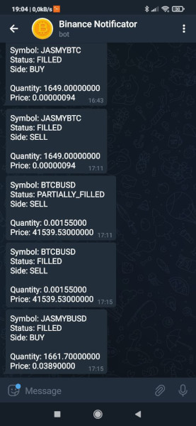

# Binance Notifier

The application was created to notify on a [Telegram](https://telegram.org/) about orders that have been filled on the [Binance](https://accounts.binance.com/en/register?ref=S90GBP2D) exchange.



I recommend using [pm2](https://pm2.keymetrics.io/) to monitor the application.

If you have an idea, suggestion or just want to report a bug? Just create an issue on GitHub.

## Installation

```shell
git clone https://github.com/tatarysh/binance-notifier.git
cd binance-notifier
yarn install
yarn build
```

You must define the following environment variables in your `.env` file:

- `BINANCE_API_KEY`
- `BINANCE_SECRET_KEY`
- `TELEGRAM_TOKEN`
- `TELEGRAM_CHAT_ID`

```shell
cp .env.example .env
nano .env
```

If you set all the variables, you can start the applications.

```shell
yarn start
```

## Environments variable

- `EXECUTION_REPORT_STATUSES` - defines for which order statuses the notification is to be sent (default: `FILLED,PARTIALLY_FILLED`)

## TODO:

- tests
- logs
- multiple channels
- price alerts (?)
